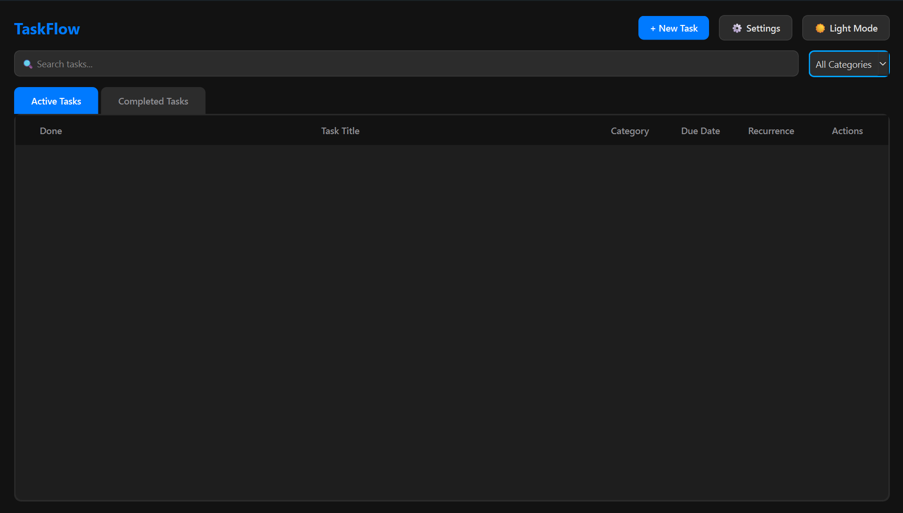

# ⚡ TaskFlow

A clean, Any.do-inspired desktop task manager and smart reminder built with Python, PyQt6, and SQLite.



## ✨ Features
* 📋 **Task Management:** Full task tracking with customizable categories, notes, and due dates.
* 🌙 **Any.do Aesthetic:** Clean minimalist UI with light and dark mode toggling.
* 🔔 **Non-Blocking Popups:** Floating toast notifications for due tasks with Snooze & Mark Done controls.
* 📌 **System Tray Integration:** Runs quietly in the system tray near the clock.
* ⚡ **Global Hotkey:** Press `Ctrl + Shift + H` anywhere on Windows to open the Quick Add Task popup.
* 💤 **System Wake Detection:** Detects computer wake-up from sleep to display pending tasks.
* 💾 **AppData Persistence:** Stores task databases in `%LOCALAPPDATA%\TaskFlow` so data stays safe across updates.

## 🚀 Quick Start (For Users)
1. Download `SmartHomeworkTracker.exe` from the [Releases](https://github.com/xavatron71/TaskFlow/releases) page.
2. Double-click to launch—no Python installation required.

## 🛠️ Development & Building

```bash
# Clone repository
git clone [https://github.com/xavatron71/TaskFlow.git](https://github.com/xavatron71/TaskFlow.git)
cd TaskFlow

# Install dependencies
pip install -r requirements.txt

# Run application
python main.py

# Build single-file executable
python -m PyInstaller --noconsole --onefile --name="SmartHomeworkTracker" main.py